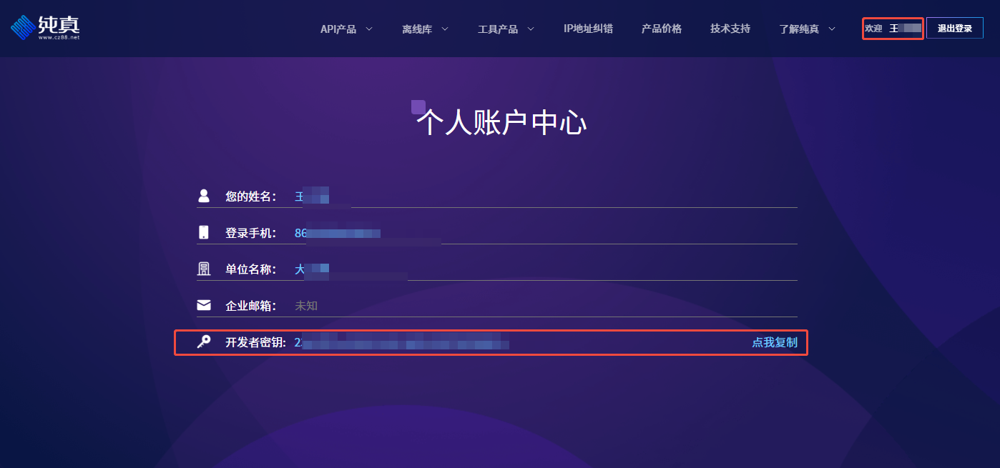
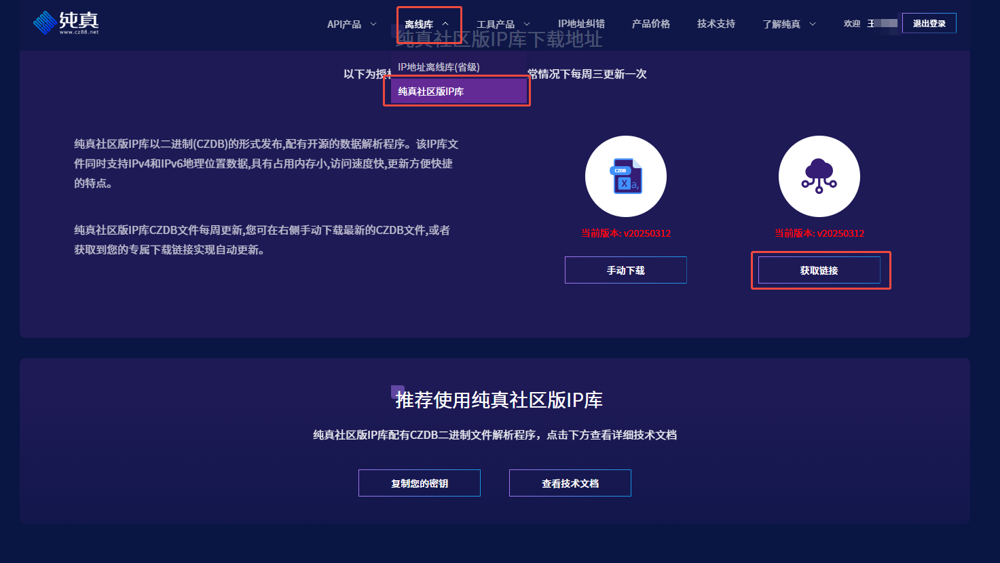
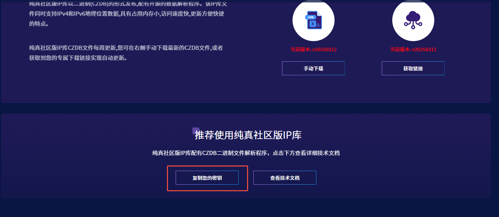

# cz-ip-service

## 介绍

纯真ip社区库作为基础数据，提供接口请求服务  

## 密钥获取

来这里 [https://www.cz88.com/geo-public](https://www.cz88.com/geo-public) 获取开发者key和fileKey和secretKey

1. 开发者key
   
2. fileKey
   > 点击复制我们会得到一个下载链接，这里我们只需要连接中的key部分数据即可  
   > `https://www.cz88.net/api/communityIpAuthorization/communityIpDbFile?fn=czdb&key=1234567890`  
   > 1234567890 就是我们需要的 fileKey

   

3. secretKey
   

## 软件架构

该项目是一个基于Go语言开发的IP地址查询服务，使用纯真IP数据库提供IP地址的地理位置信息。采用分层架构设计，主要包含以下几个部分：

1. **API层**
   - 提供JSON和MessagePack两种数据格式的接口
   - 包含单IP查询和批量IP查询功能
   - 基于Gin框架实现的Web服务

2. **服务层**
   - 核心业务逻辑处理
   - IP数据库的更新、加载和查询
   - 支持IPv4和IPv6地址查询

3. **数据访问层**
   - 封装对纯真IP数据库的访问
   - 支持文件解密和随机访问
   - 高效的IP地址查询算法

4. **工具层**
   - 提供日志、加密解密、文件操作等通用功能
   - 配置管理和环境变量解析

5. **Web界面**
   - 简洁的HTML前端界面
   - 提供直观的IP查询功能

系统依赖：

- Gin框架：提供Web服务和路由功能
- MessagePack：高效的二进制序列化格式，用于API数据传输
- Zap：高性能日志库
- ENV：环境变量解析库

数据流向：

1. 客户端发送IP查询请求
2. API层接收请求并转发给服务层
3. 服务层调用数据访问层从IP数据库中查询数据
4. 查询结果通过API层返回给客户端

项目特点：

- 支持自动更新IP数据库
- 提供多种数据格式的API接口
- 高效的内存映射数据库访问
- 支持容器化部署

## 安装教程

1. 下载依赖

    ``` shell
    go mod tidy
    ```

2. 构建

    ``` shell
    go build main.go
    ```

3. 启动

    ``` shell
    ./main -developerKey=developerKey -fileKey=fileKey -secretKey=secretKey
    ```

4. 访问

   ``` shell
   curl http://127.0.0.1/json?ip=1.1.1.1
   curl http://127.0.0.1
   ```

## 参与贡献

1. Fork 本仓库
2. 新建 Feat_xxx 分支
3. 提交代码
4. 新建 Pull Request

## 感谢
- [纯真IP数据库](https://www.cz88.net)
- [Gin](https://github.com/gin-gonic/gin)
- [MessagePack](https://github.com/vmihailenco/msgpack)
- [Zap](https://github.com/uber-go/zap)
- [ENV](https://github.com/caarlos0/env)
- [Go](https://golang.org)
- [czdb-search-golang](https://github.com/SpectatorNan/czdb-search-golang)